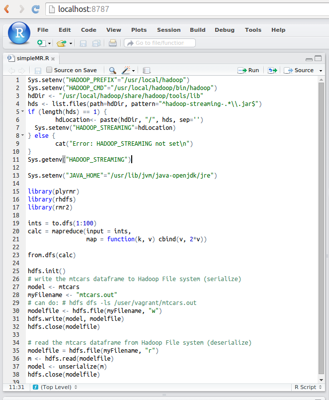

# Introduction

This Vagrant project creates a VM with single node setup of R, R Studio Server, rhdfs, plyrmr, and Hadoop v2.3.0 with YARN installed. This allows R developers to use Map Reduce, access HDFS, and develop R code alongside Hadoop.

This work adds R, RHadoop, and R-Studio Server to the Hadoop Vagrantfile from VangJee (see references).

# Getting Started

1. [Download and install VirtualBox](https://www.virtualbox.org/wiki/Downloads)
2. [Download and install Vagrant](http://www.vagrantup.com/downloads.html).
3. Run ```vagrant box add centos65 https://github.com/2creatives/vagrant-centos/releases/download/v6.5.1/centos65-x86_64-20131205.box```
4. Git clone this project, and change directory (cd) into this project (directory).
5. Run ```vagrant up``` to create the VM.
6. Run ```vagrant ssh``` to get into your VM.
7. Run ```vagrant halt``` when you want to shut down the VM
8. Run ```vagrant destroy``` when you want to destroy and get rid of the VM.
9. Got to ```http://localhost:8787``` when you want use R Studio Server with Hadoop (username/password: vagrant/vagrant)
10. Run simpleMR.R in R-Studio to confirm Map Reduce and HDFS is working

Some gotcha's.

1. Make sure you download Vagrant v1.4.3 or higher (I'm using Vagrant 1.72 on Ubuntu 14.04).
2. Make sure when you clone this project, you preserve the Unix/OSX end-of-line (EOL) characters. The scripts will fail with Windows EOL characters.
3. Make sure you have 8Gb of free memory for the VM. You may change the Vagrantfile to specify smaller memory requirements.
4. This project has NOT been tested with the VMWare provider for Vagrant.
5. You may change the script (setup.sh) to point to a different location for Hadoop to be downloaded from. Here is a list of mirrors: http://www.apache.org/dyn/closer.cgi/hadoop/common/.
6. Some R code is dynamically generated with some 'best effort' attempts to 'future-proof the code, but as the toolsets are changing so quickly, you can modify the 'setup.sh' code to accommodate newer versions of Hadoop, R Studio, R, etc.
7. Check the CRAN site set in 'installPkg.R' to ensure it makes sense for your geography
8. I could not cache a copy of Java on the local file system as the dependencies seem to be dynamically evaluated. Therefore I did bother to pre-download a Java environment.

# Make the VM setup faster
You can make the VM setup even faster if you pre-download the Hadoop and R Studio Server into the /resources directory.

1. /resources/hadoop-2.3.0.tar.gz
2. /resources/rstudio-server-0.98.1102-x86_64.rpm

The setup script will automatically detect if these files (with precisely the same names) exist and use them instead. If you are using slightly different versions, you will have to modify the script accordingly.

OS/Versions of files that I've verified. Of course, YMMV.
* Ubuntu 14.04
* Vagrant 1.72
* VirtualBox 4.3.10
* plyrmr-0.6.0
* rmr-3.3.1
* rhdfs-1.0.8
* RStudio Server 0.98.1102-x86_64.rpm


# Web UI
You can check the following URLs to maccess R Studio and monitor the Hadoop daemons.

1. [R Studio Server] (http://localhost:8787)
2. [NameNode] (http://localhost:50070/dfshealth.html)
3. [DataNode] (http://localhost:50075/dataNodeHome.jsp)
4. [ResourceManager] (http://localhost:8088/cluster)
5. [NodeManager] (http://localhost:8042/node)
6. [JobHistory] (http://localhost:19888/jobhistory)


Note that you point your browser to "localhost" because when the VM is created, it is specified to perform port forwarding from your desktop to the VM.

# Map Reduce, HDFS access in R
Here is a simple Map Reduce example which can be excuted via R-Studio server using this VM.


# Vagrant boxes
A list of available Vagrant boxes is shown at http://www.vagrantbox.es. 

# Vagrant box location
The Vagrant box is downloaded to the ~/.vagrant.d/boxes directory. On Windows, this is C:/Users/{your-username}/.vagrant.d/boxes.

# References
This project was kludge together with great pointers from all around the internet. 

1. https://vangjee.wordpress.com/2014/03/05/installing-a-single-node-hadoop-v2-3-0-instance-with-yarn-using-vagrant/
2. https://github.com/vangj/vagrant-hadoop-2.3.0.git
3. http://docs.vagrantup.com/v2/getting-started/
4. http://docs.vagrantup.com/v2/provisioning/basic_usage.html 
5. http://www.cloudera.com/content/cloudera-content/cloudera-docs/CDH4/4.2.0/CDH4-Installation-Guide/cdh4ig_topic_11_2.html 
6. http://www.rstudio.com/products/rstudio/download-server/ 
7. https://github.com/RevolutionAnalytics/RHadoop/wiki 
8. https://github.com/RevolutionAnalytics/plyrmr/blob/master/docs/tutorial.md 

# Copyright Stuff
Copyright 2015 KevChin

Licensed under the Apache License, Version 2.0 (the "License");
you may not use this file except in compliance with the License.
You may obtain a copy of the License at

    http://www.apache.org/licenses/LICENSE-2.0

Unless required by applicable law or agreed to in writing, software
distributed under the License is distributed on an "AS IS" BASIS,
WITHOUT WARRANTIES OR CONDITIONS OF ANY KIND, either express or implied.
See the License for the specific language governing permissions and
limitations under the License.
